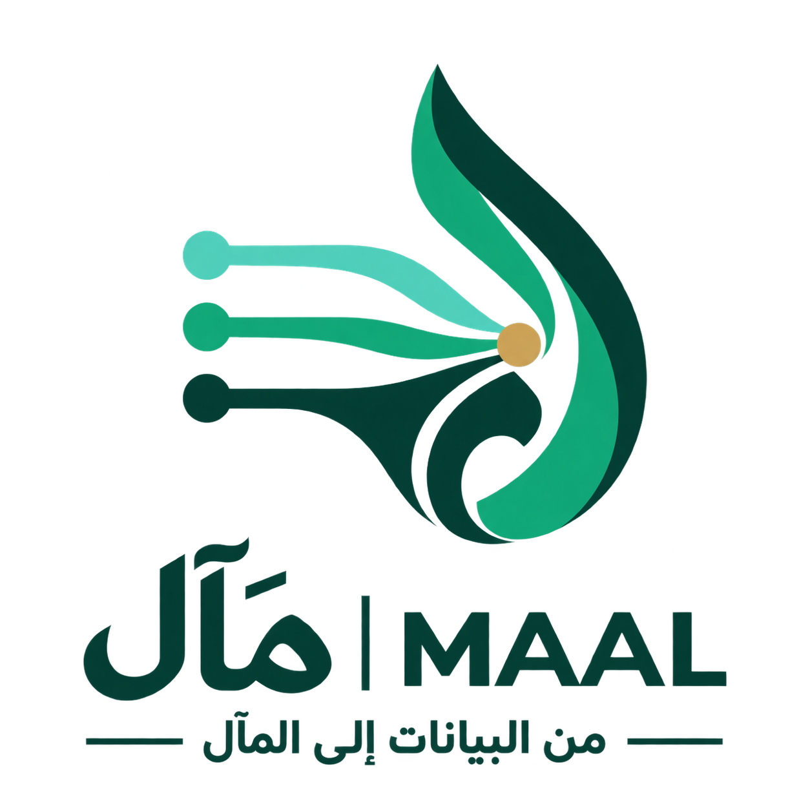

<!doctype html>
<html lang="en" dir="ltr">
<head>
  <meta charset="utf-8">
  <meta name="viewport" content="width=device-width, initial-scale=1">
  <meta name="theme-color" content="#102925">
  <meta name="description" content="MAAL — adaptive decision support for the next water-quality test when data is incomplete.">
  <title>MAAL | The Next Best Test</title>
  <link rel="preconnect" href="https://fonts.googleapis.com">
  <link rel="preconnect" href="https://fonts.gstatic.com" crossorigin>
  <link href="https://fonts.googleapis.com/css2?family=DM+Sans:wght@400;500;600;700&family=IBM+Plex+Sans+Arabic:wght@400;500;600;700&display=swap" rel="stylesheet">
  
</head>
<body>
  

    <header class="topbar shell">
      <a class="brand" href="#top" aria-label="MAAL home">MAAL From data to what matters next</a>
      
<button id="langToggle" class="language" type="button" aria-label="Switch to Arabic">العربية ↗</button>

    </header>
    <main id="top">
      <section class="hero shell" aria-labelledby="headline">
        

          
<i aria-hidden="true"></i>SAIF 2026 · PROOF OF CONCEPT

          <h1 id="headline">For every gap in the data, a next step worth taking.</h1>
          
MAAL recommends the next water-quality analysis when information is incomplete, then updates its priorities as new results arrive.

          

            <a class="btn btn-primary" href="https://maal-water-logic.base44.app/" target="_blank" rel="noopener noreferrer">Explore the prototype<svg viewBox="0 0 24 24" fill="none" stroke="currentColor" stroke-width="1.8" aria-hidden="true"><path d="M5 12h14m-6-6 6 6-6 6"/></svg></a>
            <a class="btn btn-outline" id="pdfLink" href="./MAAL%20-%20%D9%85%D9%84%D9%81%20%D8%A7%D9%84%D9%85%D8%B4%D8%B1%D9%88%D8%B9%20%D8%A7%D9%84%D8%AF%D8%A7%D8%B9%D9%85.pdf" target="_blank" rel="noopener noreferrer">View supporting PDF<svg viewBox="0 0 24 24" fill="none" stroke="currentColor" stroke-width="1.8" aria-hidden="true"><path d="M7 3h7l4 4v14H7zM14 3v5h5M10 13h5m-5 4h5"/></svg></a>
          

          
Public reference data · Prototype estimates are not laboratory results

        

        

          

          

            <svg class="orbit" viewBox="0 0 480 480" aria-hidden="true"><path d="M125 115C165 108 199 151 239 239M91 254C146 243 174 242 239 239M239 239C295 275 321 325 381 376"/><path class="trace" d="M91 254C146 243 174 242 239 239C295 275 321 325 381 376"/></svg>
            

            
<small data-i18n="stage1small">INPUT</small><strong>Known data</strong>

            
<small data-i18n="stage2small">GAP</small><strong>Missing values</strong>

            
<small data-i18n="stage3small">NEXT</small><strong data-i18n="stage3">Recommended test ↗</strong>

            
          

        

      </section>
      

<strong>2,057</strong>public measurements

<strong>711</strong>analytical cases

<strong>50 → 66.7%</strong>example: data completeness

      <section class="section shell" aria-labelledby="howTitle">
        

THE IDEA
<h2 id="howTitle" data-i18n="howTitle">A decision path that learns from every new result.</h2>

A demonstration of how the next analytical step can change when a missing result becomes available.

        

          
01 / DATA<h3 data-i18n="card1title">See the gaps</h3>
Separate measured values from missing and AI-estimated values.

          
02 / PRIORITY<h3 data-i18n="card2title">Choose the next test</h3>
Compare decision impact, uncertainty, time, and analysis cost.

          
03 / ADAPT<h3 data-i18n="card3title">Update the route</h3>
Enter a new laboratory result and recalculate the recommendation.

        

        

MAAL is an early decision-support prototype using public reference data. It does not certify water safety or replace laboratory testing or expert judgment.
<a class="final-cta" href="https://maal-water-logic.base44.app/" target="_blank" rel="noopener noreferrer" data-i18n="open">See it in action ↗</a>

      </section>
    </main>
    <footer class="footer shell">© 2026 MAAL · Reem Buraykan Alshammari · <a href="mailto:reembrykan@gmail.com">reembrykan@gmail.com</a>A Saudi innovation concept</footer>
  

  
</body>
</html>
